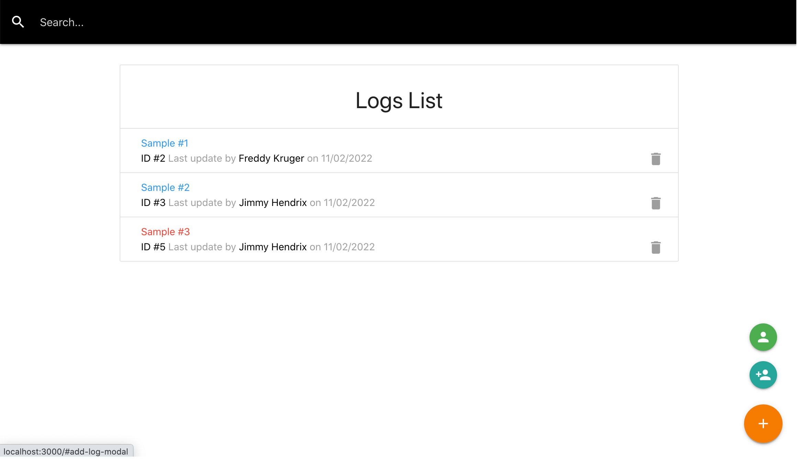
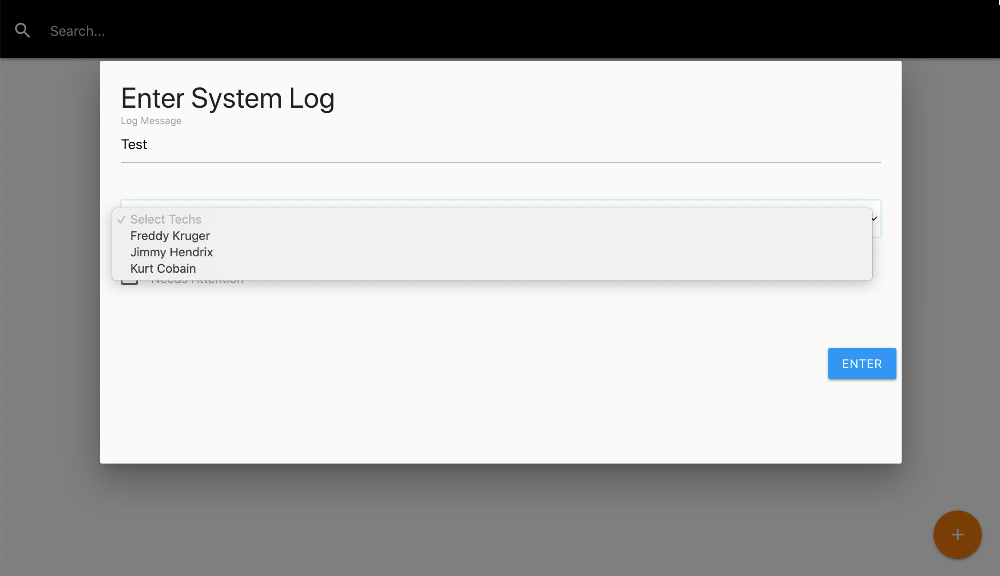

<h1 align="center">
  React Logger</br> 
Vite + Redux + Typescript
</h1>

<p align="center">
  <a href="https://github.com/SafdarJamal/vite-template-react/releases">
    
  </a>
  <a href="https://github.com/SafdarJamal/vite-template-react/blob/main/LICENSE">
    
  </a>
</p>

<p align="center">
    A <a href="https://vitejs.dev">Vite</a> + <a href="https://reactjs.org">React</a> template.
</p>


React Typescript app with Redux Toolkit:

- Get Log
- Create Log
- Update Log
- Delete Log
- Search log
- Get Technical
- Create Technical 
- Delete Technical
- Button RollOver animation

<p align="center">
  
  
</p>

## Development

To get a local copy of the code, clone it using git:

Install dependencies:

```
npm i
```

Now, you can start a local web server by running:

```
npm start
```

And then open http://localhost:3000 to view it in the browser.


```
npm run json-server
```

And then open http://localhost:5000 to view Fake Server Json 


#### Available Scripts

In this project, you can run the following scripts:

| Script        | Description                                         |
| ------------- |-----------------------------------------------------|
| npm run dev   | Runs the app in the development mode.               |
| npm run build | Builds the app for production to the `dist` folder. |
| npm run serve | Serves the production build from the `dist` folder. |
| npm run json-server | Run fake Json server                                |


## License

This project is licensed under the terms of the [MIT license](https://github.com/SafdarJamal/vite-template-react/blob/main/LICENSE).
